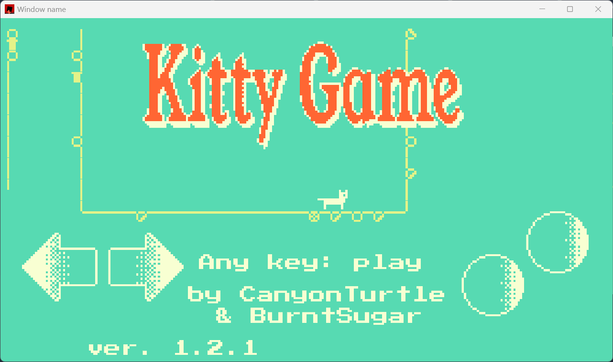

# MQT



Play online here: <https://canyonturtle.github.io/mqt/>

Kitty game, ported to 3 game engines (originated on wasm4, then ported to macroquad, then to bevy).

## Why port a game to 3 platforms?
Mostly, for educational purposes. But this is an interesting way to compare the pixel-game abilities of various Rust platforms as well.

## How is the code portable?
The main game is very light graphically - it requires only the ability to get key/touch input, draw text, draw lines and points, and draw subsections of a spritesheet with a given palette. So, the core is abstracted out (see `/kittygame`) and then each platform defines functions and input polls (e.g. `/macroquad_plat`).

# Porting Wasm4 to Macroquad makes sense, but... bevy? Also, how?
Mostly for bevy's incredible and growing platform support.
This was the trickiest port to figure out, because bevy docs are notoriously fluid. But what works for me is what seems to work
for others - create a low-aspect image, render sprites to that image, then scale it up. The key insight too is that creating
texture atlases and sprites in Bevy is pretty cheap - I'm able to create dozens of shallow sprites *per-frame*
and delete them right after (they only exist as a way to draw part of a spritesheet for a moment; they're decoupled from the rest of the ECS).

## Try
Install the usual build tools for Bevy, Macroquad, and Wasm-4 on your local machine. Then, in a terminal:

```bash
# default (macroquad)
cargo run

# macroquad on web (install basic-http-server from cargo).
cargo build --release --target wasm32-unknown-unknown \
    && install target/wasm32-unknown-unknown/release/mqt.wasm cart.wasm \
    && basic-http-server .

# bevy
cargo run --package bevy_plat

# wasm-4
cargo build --release --package wasm4_plat --config .cargo/config.wasm4.toml && w4 run target/wasm32-unknown-unknown/release/wasm4_plat.wasm
```

Snoop around the shell scripts for more build options.
